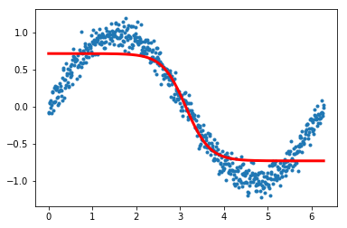
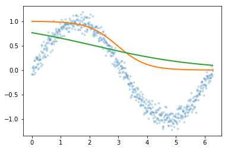
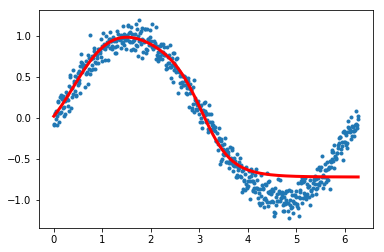
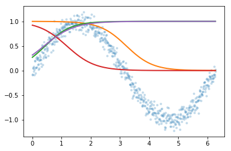
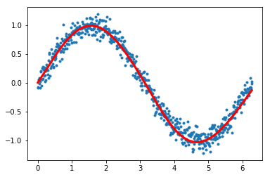
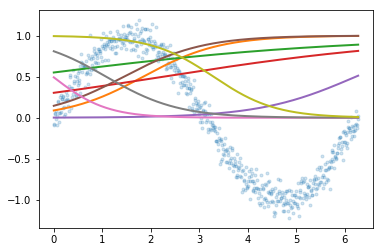
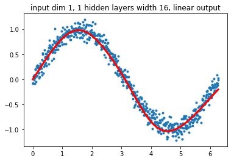
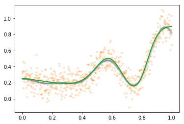
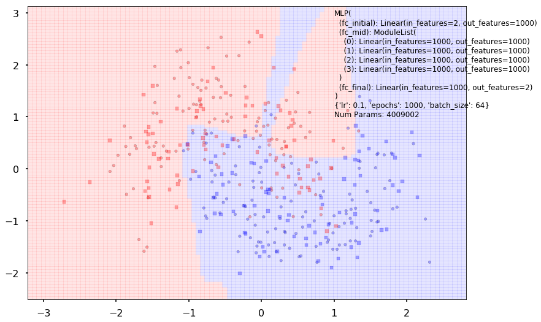

autoscale: true
footer:


---

#[fit] Ai 1

---

##[fit] Lets Start

---

## Start with:

The **make you dangerous** workshop.

And then, the make you super dangerous and rigorous full course.

(for those taking the full deal...)

---

## Resources we'll use today

- your machine
- Google Colab
- binder

---

## Resources for Full Dealers

(coming this week)

- Formation of groups for homework and fun
- Discussion Forum across college campuses
- Educational platform
- GPU based custom compute (for project)
- TA mentorship and office hours
- Professor office hours

---

##[fit] Do not feel shy 

##[fit] to ask anything

---


##[fit]

##[fit] Learning a

##[fit] 3

---


---

## The perceptron  $$f((w, b) \cdot (x, 1))$$


---

## Combine Perceptrons


---


---


---

## Non-Linearity


we want a non-linearity as othersie combining linear regressions just gives a big honking linear regression

---


---


## Universal Approximation: Learn a complex function

THEOREM:

- any one hidden layer net can approximate any continuous function with finite support, with appropriate choice of nonlinearity
- but may need lots of units
- and will learn the function it thinks the data has, not what you think

---

#### One hidden, 1 vs 2 neurons 




---

#### Two hidden, 4 vs 8 neurons




---



---

## Relu (80, 1 layer) and tanh(40, 2 layer)



---

## Half moon dataset (artificially GENERATED)


---

#### 1 layer, 2 vs 10 neurons


---

#### 2 layers, 20 neurons vs 5 layers, 1000 neurons



---

##[fit] How

##[fit] do we learn?

---


---

## Why does deep learning work?

1. Automatic differentiation 
2. GPU
3. Learning Recursive Representations

Something like:

$$s(w_n.z_n + b_n)$$ where $$z_n = s(w_{n-1}.z_{n-1}+b_{n-1})$$ and 

$$s(w_{n+1}.z_{n+1} + b_{n+1})$$ where $$z_{n+1} = s(w_{n}.z_{n}+b_{n})$$ and 

and so on.

---

## How do we do digits?

## And How do we do?

---

## Code in Keras

```python
# load data
(X_train, y_train), (X_test, y_test) = mnist.load_data()
img_width = X_train.shape[1]
img_height = X_train.shape[2]

X_train = X_train.astype('float32')
X_train /= 255.
X_test = X_test.astype('float32')
X_test /= 255.

# one hot encode outputs
y_train = np_utils.to_categorical(y_train)
y_test = np_utils.to_categorical(y_test)
labels = range(10)
num_classes = y_train.shape[1]

# create model
model = Sequential()
model.add(Flatten(input_shape=(img_width, img_height)))
model.add(Dense(config.hidden_nodes, activation='relu'))
model.add(Dense(num_classes, activation='softmax'))
model.compile(loss='categorical_crossentropy', optimizer=config.optimizer,
              metrics=['accuracy'])
model.summary()
# Fit the model
model.fit(X_train, y_train, validation_data=(X_test, y_test),
          epochs=config.epochs,
          callbacks=[WandbCallback(data_type="image", labels=labels)])
```

---


---

## Where else can we go?

---


---

## Images


---

## Channels first arrangement


---

## What about multiple images?


---

## And a single image?


---

# MLP's dont actually work how we want them to!

---


---

## Convolutional Networks

- pay attention to the spatial locality of images
- this is done through the use of "filters"
- thus the representations learnt are spatial and bear a mapping to reality
- and are hierarchical..later layers learn features composed from the previous layers
- perhaps even approximating what the visual cortex does.

---

##[fit] Convolutional Components

---

Fully Connected layers, 1-1 layers, regularization layers like dropout


---

## The idea of a filter: detecting yellow


---


---

## Convolution Layer  $$f((w, b) \cdot (x, 1))$$


---

##[fit]  Convolution looks for 
##[fit] patterns

---


---

Movethe filter over the original image and produce a new one


---

## Padding


- Image size decrease by a convolution is called a "valid" convolution.
- Keeping the same size by 0-padding is called a "same" convolution

---

## Downsampling: pooling, striding


---

## Layer types schematic


---


## Hierarchical Filters

- do we then need to know every pattern we can find? NO! We learn the weights.
- now we do this hierarchically, with each filter at the next layer
- we hope to learn representations made up from smaller scale representations and so on
- here is an example: find the LHS face in the RHS image...


---

## Strategy


- Move layer 1 filters around
- max pool 27x27 to 9x9
- x means dont care about value
- now apply second level filter to 9x9 image
- max pool again to 3x3 image
- apply level 3 filters and see if we activate

---

## How Channels work: each color a different feature


---

## Channel Arithmetic


input is (say) 26x26x6, so filters MUST have 6 channels and we have 4 new featuremaps: `Conv2D(4,(3,3))`

---

```python
batch_size = 128
num_classes = 10
epochs = 12

# input image dimensions
img_rows, img_cols = 28, 28
input_shape = (28, 28)

model = Sequential()
model.add(Conv2D(32, kernel_size=(3, 3),
                 activation='relu',
                 input_shape=input_shape))
model.add(Conv2D(64, (3, 3), activation='relu'))
model.add(MaxPooling2D(pool_size=(2, 2)))
model.add(Dropout(0.25))
model.add(Flatten())
model.add(Dense(128, activation='relu'))
model.add(Dropout(0.5))
model.add(Dense(num_classes, activation='softmax'))

model.compile(loss=keras.losses.categorical_crossentropy,
              optimizer=keras.optimizers.Adadelta(),
              metrics=['accuracy'])
```

---

# VGG16


---

## How VGG16 learns


---


